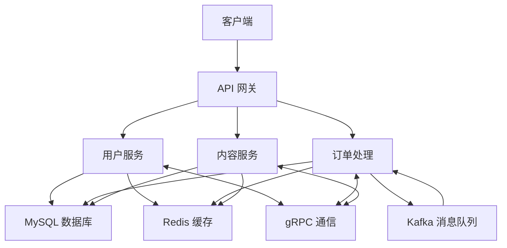

# bingHMDP 微服务架构技术文档

## 1. 项目概述

HMDP 是一个基于 Go 语言开发的本地生活服务平台，采用微服务架构设计。该项目从单体应用拆分为三个核心微服务：用户服务、购物服务和内容服务，主要功能包括用户管理、商铺管理、博客管理、优惠券管理、订单管理、关注功能和文件上传等。

### 1.1 技术栈

| 技术 | 版本 | 用途 |
|------|------|------|
| Go | 1.25 | 主要开发语言 |
| Gin | 1.12.0 | Web 框架 |
| gRPC | 1.66.0 | 微服务间通信 |
| GORM | 1.31.1 | ORM 框架 |
| MySQL | - | 关系型数据库 |
| Redis | - | 缓存、分布式锁、分布式ID |
| Kafka | - | 消息队列，用于异步处理订单 |
| Etcd | - | 服务发现和配置管理 |
| JWT | 5.3.1 | 身份认证 |
| Viper | 1.18.2 | 配置管理 |

## 2. 目录结构

```
hmdp-microservices/
├── user-service/        # 用户服务
│   ├── config/          # 配置管理
│   │   ├── config.go    # 配置结构体和加载逻辑
│   │   ├── config.yaml  # YAML配置文件
│   │   ├── db.go        # 数据库连接初始化
│   │   └── redis.go     # Redis 连接初始化
│   ├── controller/      # 控制器层
│   ├── model/           # 数据模型
│   ├── repository/      # 数据访问层
│   ├── service/         # 业务逻辑层
│   ├── utils/           # 工具类
│   ├── proto/           # gRPC协议定义
│   ├── go.mod           # Go 模块文件
│   └── main.go          # 主程序入口
├── shop-service/        # 购物服务
│   ├── config/          # 配置管理
│   │   ├── config.go    # 配置结构体和加载逻辑
│   │   ├── config.yaml  # YAML配置文件
│   │   ├── db.go        # 数据库连接初始化
│   │   └── redis.go     # Redis 连接初始化
│   ├── controller/      # 控制器层
│   ├── model/           # 数据模型
│   ├── repository/      # 数据访问层
│   ├── service/         # 业务逻辑层
│   ├── utils/           # 工具类
│   ├── proto/           # gRPC协议定义
│   ├── go.mod           # Go 模块文件
│   └── main.go          # 主程序入口
├── content-service/     # 内容服务
│   ├── config/          # 配置管理
│   │   ├── config.go    # 配置结构体和加载逻辑
│   │   ├── config.yaml  # YAML配置文件
│   │   ├── db.go        # 数据库连接初始化
│   │   └── redis.go     # Redis 连接初始化
│   ├── controller/      # 控制器层
│   ├── model/           # 数据模型
│   ├── repository/      # 数据访问层
│   ├── service/         # 业务逻辑层
│   ├── utils/           # 工具类
│   ├── proto/           # gRPC协议定义
│   ├── go.mod           # Go 模块文件
│   └── main.go          # 主程序入口
└── common/              # 公共代码
    ├── config/          # 公共配置
    ├── model/           # 公共模型
    ├── utils/           # 公共工具
    └── proto/           # 公共gRPC协议定义
```

## 3. 系统架构

### 3.1 架构图



### 3.2 核心流程

1. **请求处理流程**：
   - 客户端发送请求到 API 网关
   - API 网关根据请求路径路由到对应微服务
   - 微服务处理请求，执行业务逻辑
   - 微服务与数据库和缓存交互
   - 微服务返回响应给 API 网关
   - API 网关返回响应给客户端

2. **秒杀流程**：
   - 客户端发送秒杀请求到购物服务
   - 购物服务执行 Redis 操作进行库存预扣减
   - 秒杀成功后生成订单 ID
   - 发送消息到 Kafka 异步创建订单
   - Kafka 消费者处理订单创建和库存扣减

3. **缓存流程**：
   - 先查询本地缓存
   - 本地缓存未命中，查询 Redis 缓存
   - Redis 缓存未命中，查询数据库
   - 将查询结果写入 Redis 缓存和本地缓存
   - 数据库更新时，删除对应缓存（Cache Aside 策略）

## 4. 配置管理

### 4.1 配置文件格式

项目使用 YAML 格式的配置文件，每个微服务都有自己的配置文件，位于 `config/config.yaml`。

### 4.2 配置结构

#### 用户服务配置
```yaml
server:
  port: "8081"

mysql:
  host: "127.0.0.1"
  port: "3306"
  user: "root"
  password: "001020"
  dbname: "hmdp"

redis:
  host: "localhost"
  port: "6379"
  password: "001020"
  db: 0

grpc:
  port: "50051"
```

#### 购物服务配置
```yaml
server:
  port: "8082"

mysql:
  host: "127.0.0.1"
  port: "3306"
  user: "root"
  password: "001020"
  dbname: "hmdp"

redis:
  host: "localhost"
  port: "6379"
  password: "001020"
  db: 0

grpc:
  port: "50052"

kafka:
  brokers:
    - "localhost:9092"
  topic: "order-create"
```

#### 内容服务配置
```yaml
server:
  port: "8083"

mysql:
  host: "127.0.0.1"
  port: "3306"
  user: "root"
  password: "001020"
  dbname: "hmdp"

redis:
  host: "localhost"
  port: "6379"
  password: "001020"
  db: 0

grpc:
  port: "50053"
```

### 4.3 配置加载

使用 Viper 库加载配置文件，支持从环境变量和配置文件中读取配置。如果配置文件不存在或加载失败，会使用默认配置。

## 5. 核心功能模块

### 5.1 用户服务

#### 5.1.1 功能描述
- 用户注册和登录
- 获取用户信息
- 用户签到
- 获取签到记录

#### 5.1.2 核心接口

| 接口 | 方法 | 路径 | 功能 |
|------|------|------|------|
| 发送验证码 | POST | /user/code | 发送手机验证码 |
| 用户登录 | POST | /user/login | 用户登录，返回 token |
| 获取当前用户 | GET | /user/me | 获取当前登录用户信息 |
| 获取用户详情 | GET | /user/info/:id | 获取指定用户详情 |
| 用户签到 | POST | /user/sign | 用户签到 |
| 获取签到次数 | GET | /user/sign/count | 获取用户连续签到次数 |

### 5.2 购物服务

#### 5.2.1 功能描述
- 商铺查询和管理
- 商铺类型管理
- 优惠券管理
- 秒杀优惠券
- 订单管理

#### 5.2.2 核心接口

| 接口 | 方法 | 路径 | 功能 |
|------|------|------|------|
| 获取商铺 | GET | /shop/:id | 根据 ID 获取商铺详情 |
| 分页查询商铺 | GET | /shop/list | 分页查询商铺，支持类型筛选 |
| 新增商铺 | POST | /shop | 新增商铺 |
| 更新商铺 | PUT | /shop | 更新商铺信息 |
| 删除商铺 | DELETE | /shop/:id | 删除商铺 |
| 获取商铺类型 | GET | /shop-type/list | 获取所有商铺类型 |
| 店铺优惠券 | GET | /voucher/list | 获取店铺优惠券 |
| 新增优惠券 | POST | /voucher | 新增优惠券 |
| 新增秒杀券 | POST | /voucher/seckill | 新增秒杀优惠券 |
| 秒杀下单 | POST | /voucher-order/seckill/:id | 秒杀优惠券下单 |
| 订单列表 | GET | /voucher-order/list | 获取用户订单列表 |

### 5.3 内容服务

#### 5.3.1 功能描述
- 博客发布和查询
- 博客点赞和评论
- 用户关注功能
- 关注feed

#### 5.3.2 核心接口

| 接口 | 方法 | 路径 | 功能 |
|------|------|------|------|
| 获取博客 | GET | /api/blog/:id | 根据 ID 获取博客详情 |
| 热门博客 | GET | /api/blog/hot | 分页查询热门博客 |
| 用户博客 | GET | /api/blog/user | 查询指定用户的博客 |
| 关注feed | GET | /api/blog/follow | 获取关注用户的博客 |
| 点赞博客 | POST | /api/blog/like | 点赞博客 |
| 取消点赞 | POST | /api/blog/unlike | 取消点赞 |
| 发布博客 | POST | /api/blog | 发布新博客 |
| 博客评论 | GET | /api/blog/:id/comments | 查询博客评论 |
| 发表评论 | POST | /api/blog/:id/comments | 发表评论 |
| 关注用户 | POST | /api/follow/user | 关注指定用户 |
| 取消关注 | POST | /api/follow/user | 取消关注指定用户 |
| 粉丝列表 | GET | /api/follow/followers | 获取用户的粉丝列表 |
| 关注列表 | GET | /api/follow/followings | 获取用户的关注列表 |
| 共同关注 | GET | /api/follow/common | 获取与指定用户的共同关注 |
| 是否关注 | GET | /api/follow/check | 检查是否关注指定用户 |

## 6. 技术亮点

### 6.1 秒杀系统优化
- **库存预扣减**：使用 Redis 原子操作保证库存操作的原子性
- **异步处理**：通过 Kafka 实现库存扣减与订单创建的解耦并削峰
- **性能表现**：支持 5k+ QPS 零超卖，订单创建成功率 100%，接口延时 < 50ms
- **错误处理**：Kafka 发送失败时会恢复库存和订单状态，确保数据一致性

### 6.2 缓存一致性解决方案
- **Cache Aside 策略**：数据库更新时删除对应缓存
- **异步更新**：监听 Binlog 异步更新缓存，确保最终一致性

### 6.3 多级缓存优化
- **二级缓存架构**：本地缓存 + Redis 缓存
- **性能提升**：降低了 70% 以上 DB 压力，接口响应速度提升 60%
- **热点数据处理**：针对 Hot Key 问题的特殊处理

### 6.4 分布式锁优化
- **自动续期**：实现锁的自动续期功能，避免锁过期
- **热点数据锁**：针对热点数据的特殊锁策略
- **原子操作**：使用 Lua 脚本保证锁操作的原子性

### 6.5 微服务架构
- **服务拆分**：将单体应用拆分为用户服务、购物服务和内容服务
- **gRPC 通信**：使用 gRPC 进行微服务间通信，提高性能
- **配置管理**：使用 YAML 配置文件和 Viper 库进行配置管理

## 7. 部署说明

### 7.1 环境要求
- Go 1.25 或更高版本
- MySQL 5.7 或更高版本
- Redis 6.0 或更高版本
- Kafka 2.0 或更高版本
- Etcd 3.0 或更高版本

### 7.2 配置说明

1. **配置文件**：
   - 修改每个微服务的 `config/config.yaml` 文件
   - 或设置环境变量覆盖配置

2. **服务端口**：
   - 用户服务：HTTP 8081，gRPC 50051
   - 购物服务：HTTP 8082，gRPC 50052
   - 内容服务：HTTP 8083，gRPC 50053

### 7.3 启动命令

```bash
# 启动用户服务
cd hmdp-microservices/user-service
go run main.go

# 启动购物服务
cd hmdp-microservices/shop-service
go run main.go

# 启动内容服务
cd hmdp-microservices/content-service
go run main.go
```

### 7.4 数据库初始化

1. 创建数据库：
   ```sql
   CREATE DATABASE hmdp CHARACTER SET utf8mb4 COLLATE utf8mb4_unicode_ci;
   ```

2. 导入数据：
   使用项目根目录下的 `hmdp.sql` 文件导入初始数据。

## 8. 监控与日志

### 8.1 日志记录
- 使用标准库 `log` 记录系统日志
- 关键操作和错误信息会被记录

### 8.2 监控指标
- 可以集成 Prometheus 和 Grafana 进行监控
- 建议监控的指标：
  - 请求响应时间
  - 错误率
  - 并发连接数
  - Redis 缓存命中率
  - 数据库查询时间
  - 服务间调用延迟
  - Kafka 消息处理延迟

## 9. 未来规划

### 9.1 功能扩展
- 增加支付功能
- 增加评价系统
- 增加推荐系统
- 增加消息通知

### 9.2 性能优化
- 引入分布式缓存集群
- 实现数据库读写分离
- 引入负载均衡
- 优化秒杀系统

### 9.3 技术升级
- 升级到 Go 2.0
- 使用 gRPC 进行内部服务通信
- 引入容器化部署
- 实现 CI/CD 流程

## 10. 总结

HMDP 微服务架构是一个功能完整的本地生活服务平台后端，使用 Go 语言开发，具有良好的架构设计和性能表现。项目采用微服务架构，将原来的单体应用拆分为用户服务、购物服务和内容服务三个核心微服务，通过 gRPC 进行服务间通信。

通过合理的缓存策略、分布式设计和性能优化，项目能够应对高并发场景，特别是在秒杀等流量峰值情况下。同时，项目具有良好的可扩展性，可以根据业务需求进行功能扩展和技术升级。

该项目不仅实现了完整的业务功能，也展示了 Go 语言在微服务开发中的最佳实践，包括代码组织、错误处理、并发控制等方面。
