# 接口时序图

## 1. 用户服务接口

### 1.1 发送验证码

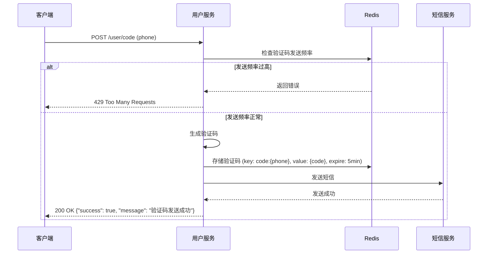

### 1.2 用户登录

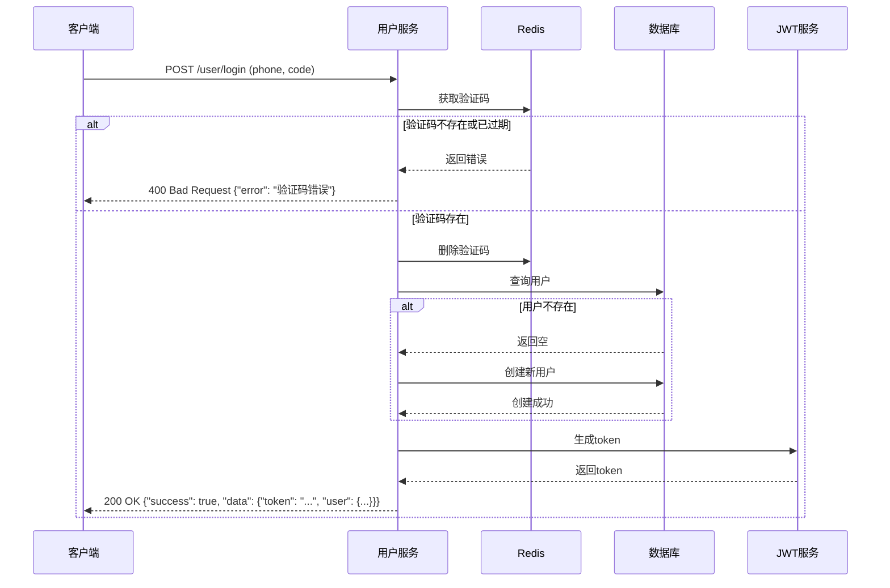

### 1.3 获取当前用户

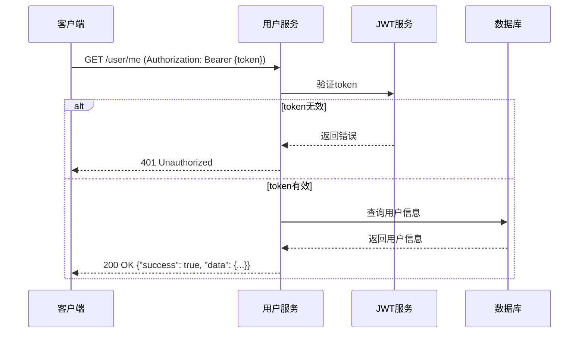

### 1.4 获取用户详情


### 1.5 用户签到

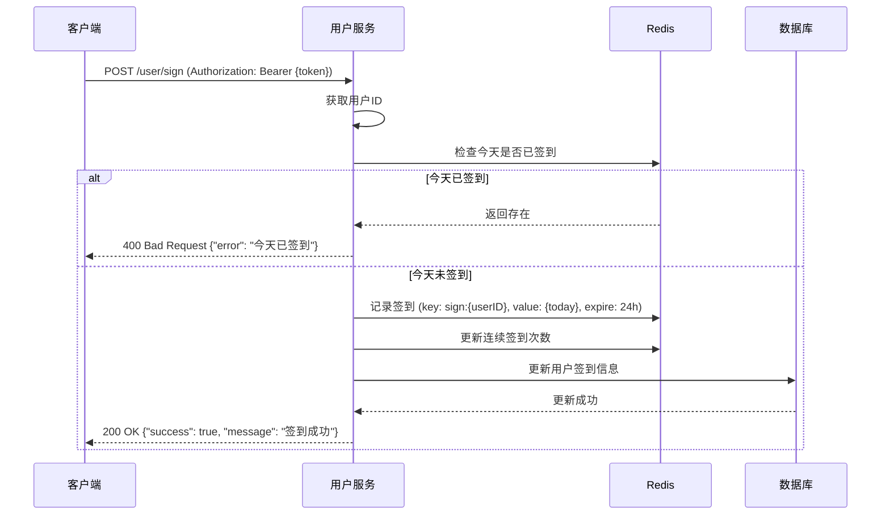

### 1.6 获取签到次数

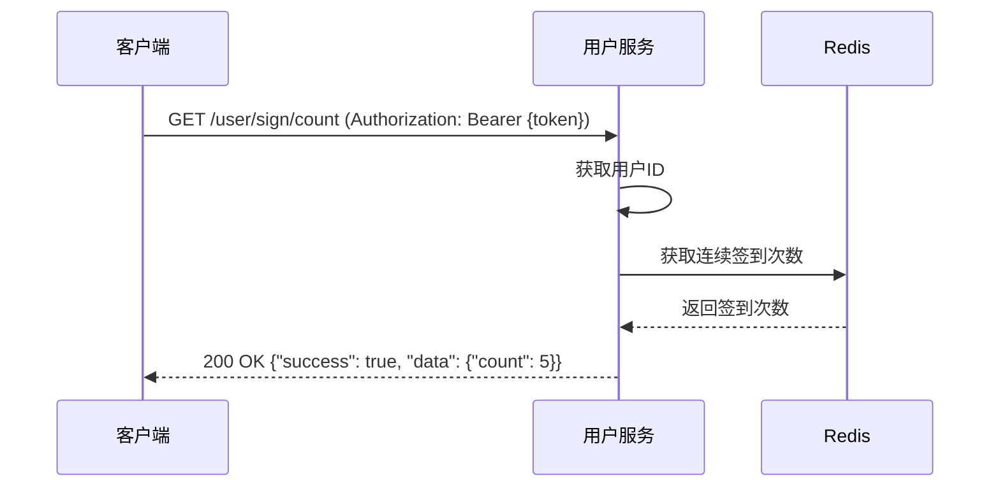

## 2. 购物服务接口

### 2.1 获取商铺

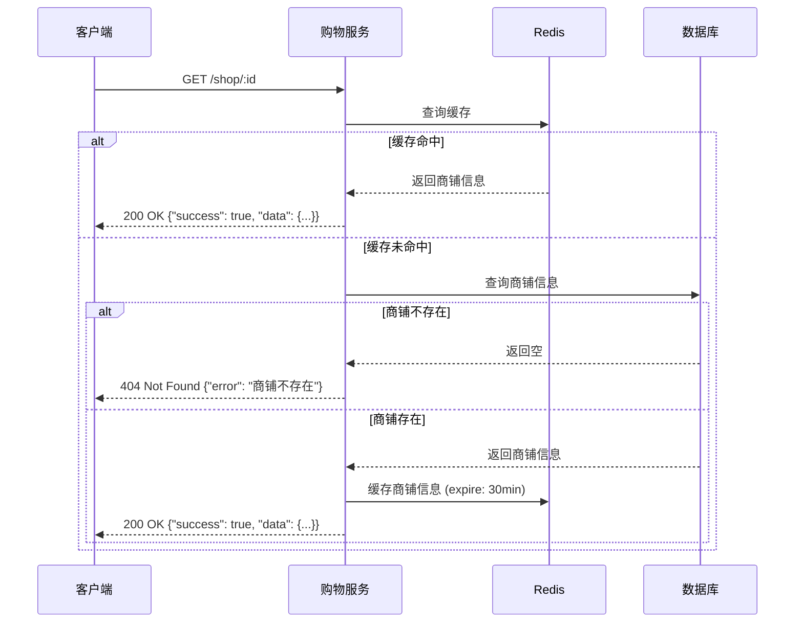

### 2.2 分页查询商铺

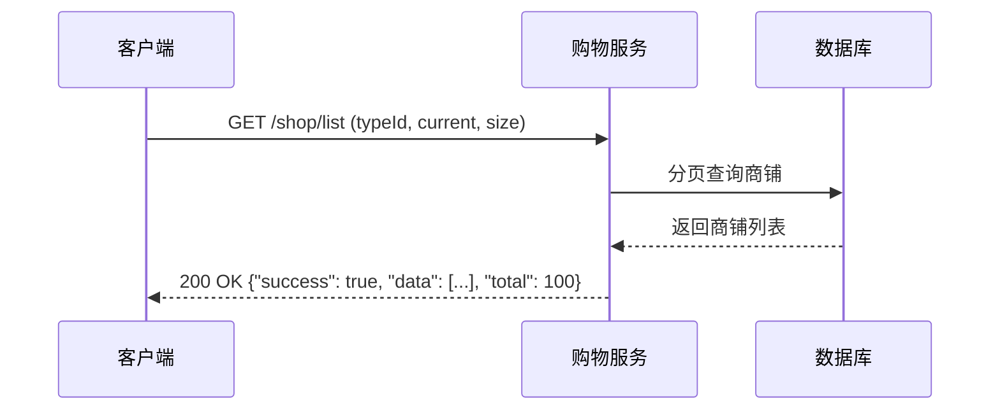

### 2.3 新增商铺

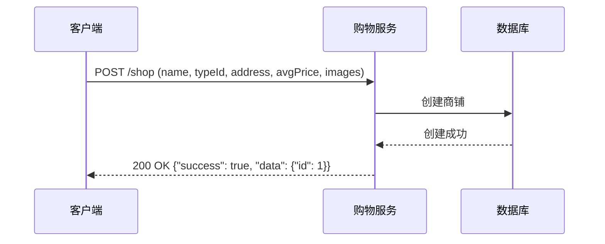

### 2.4 更新商铺

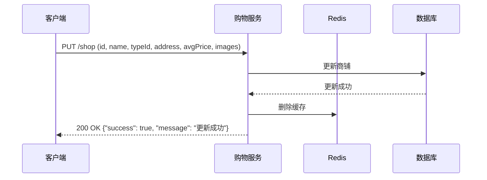

### 2.5 删除商铺

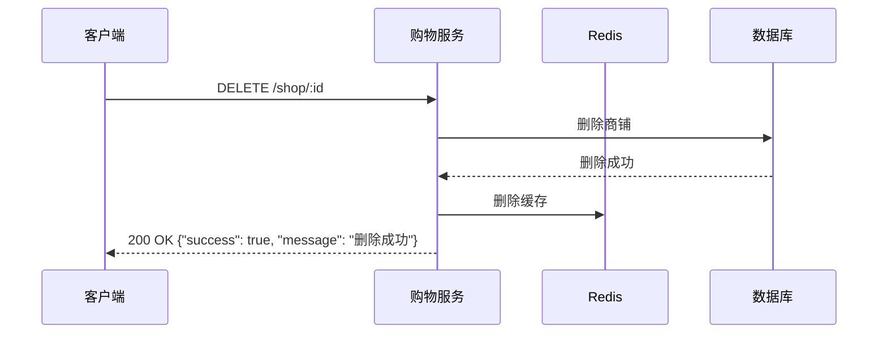

### 2.6 获取商铺类型

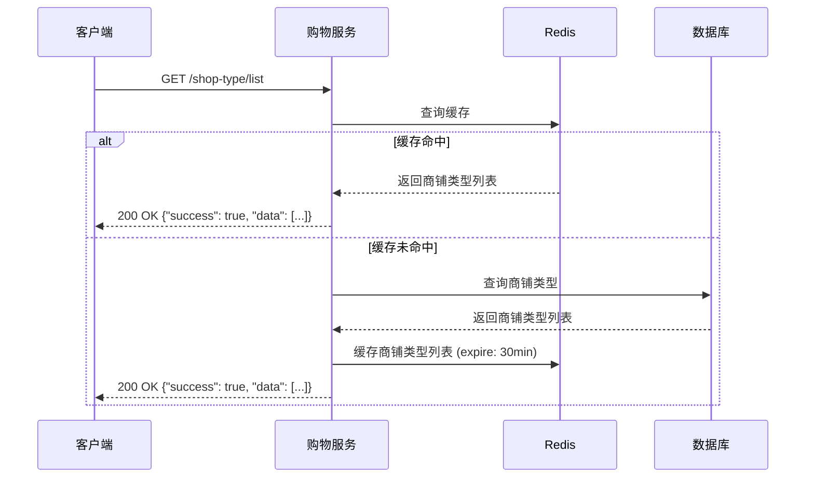

### 2.7 店铺优惠券

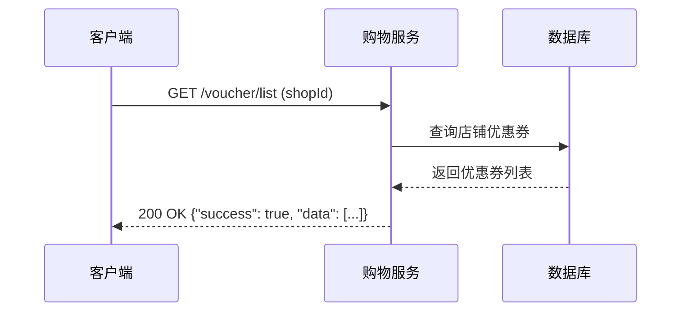

### 2.8 新增优惠券

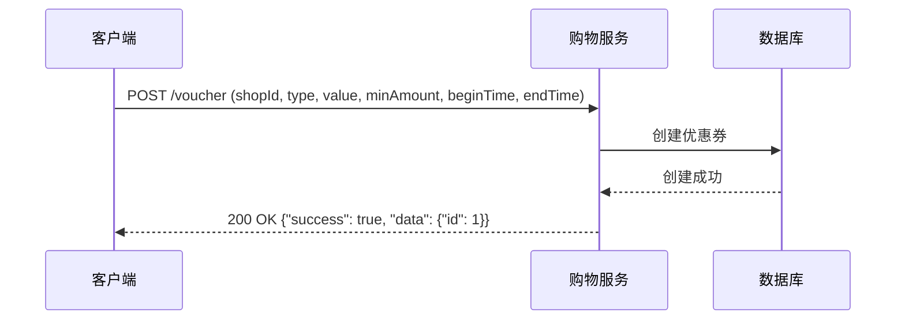

### 2.9 新增秒杀券

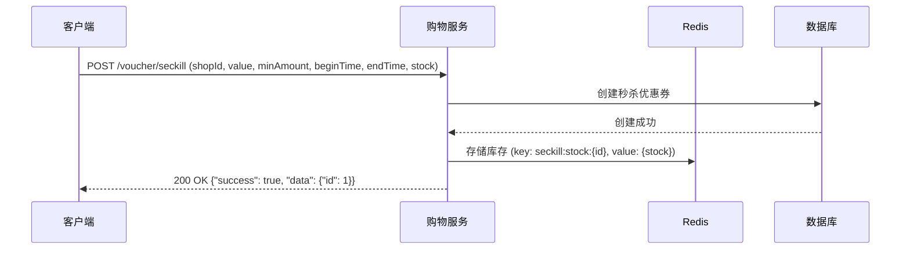

### 2.10 秒杀下单

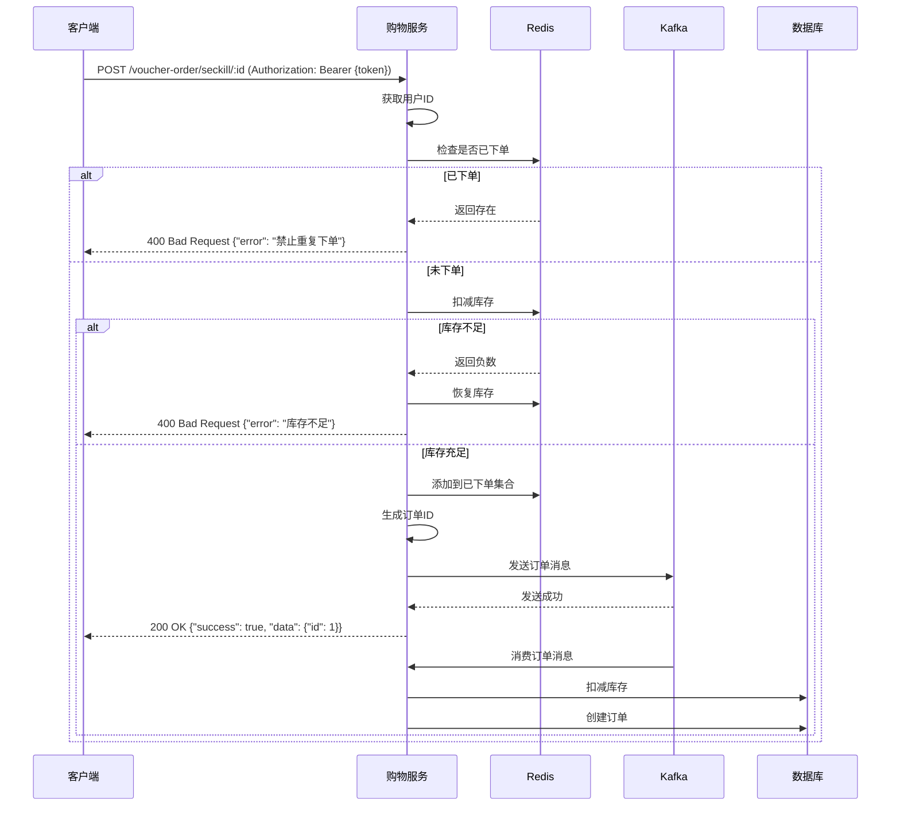

### 2.11 订单列表

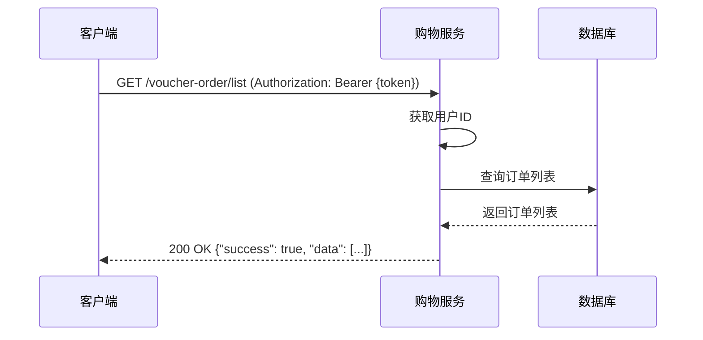

## 3. 内容服务接口

### 3.1 获取博客

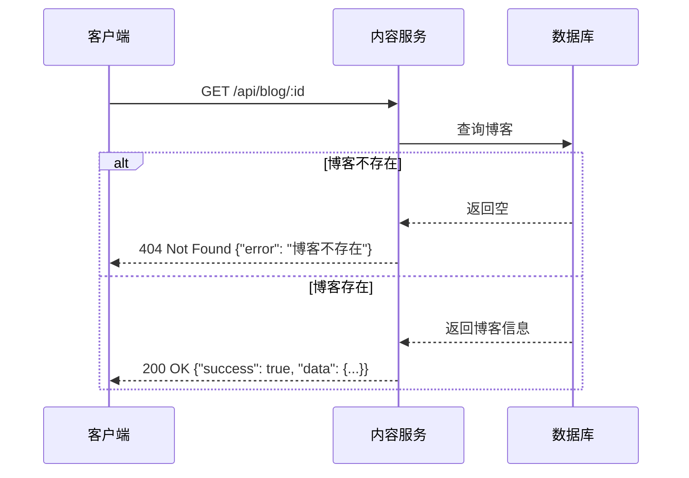

### 3.2 热门博客

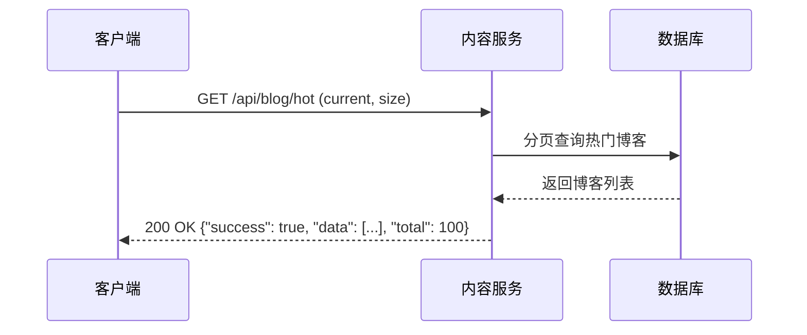

### 3.3 用户博客

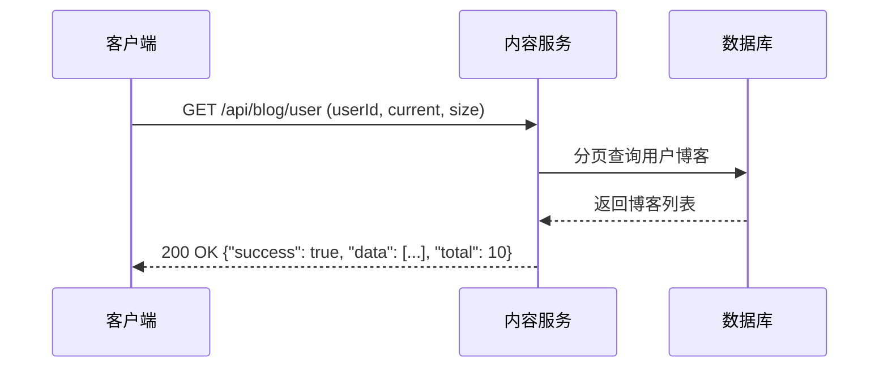

### 3.4 关注feed

```mermaid
sequenceDiagram
    participant Client as 客户端
    participant ContentService as 内容服务
    participant Redis as Redis
    participant MySQL as 数据库

    Client->>ContentService: GET /api/blog/follow (current, size) (Authorization: Bearer {token})
    ContentService->>ContentService: 获取用户ID
    ContentService->>Redis: 查询关注的博客
    Redis-->>ContentService: 返回博客ID列表
    ContentService->>MySQL: 查询博客详情
    MySQL-->>ContentService: 返回博客列表
    ContentService-->>Client: 200 OK {"success": true, "data": [...], "total": 20}
```

### 3.5 点赞博客

```mermaid
sequenceDiagram
    participant Client as 客户端
    participant ContentService as 内容服务
    participant Redis as Redis

    Client->>ContentService: POST /api/blog/like (blogId) (Authorization: Bearer {token})
    ContentService->>ContentService: 获取用户ID
    ContentService->>Redis: 检查是否已点赞
    alt 已点赞
        Redis-->>ContentService: 返回存在
        ContentService-->>Client: 400 Bad Request {"error": "已经点过赞了"}
    else 未点赞
        ContentService->>Redis: 添加点赞记录
        ContentService-->>Client: 200 OK {"success": true, "message": "点赞成功"}
    end
```

### 3.6 取消点赞

```mermaid
sequenceDiagram
    participant Client as 客户端
    participant ContentService as 内容服务
    participant Redis as Redis

    Client->>ContentService: POST /api/blog/unlike (blogId) (Authorization: Bearer {token})
    ContentService->>ContentService: 获取用户ID
    ContentService->>Redis: 检查是否已点赞
    alt 未点赞
        Redis-->>ContentService: 返回不存在
        ContentService-->>Client: 400 Bad Request {"error": "未点赞"}
    else 已点赞
        ContentService->>Redis: 删除点赞记录
        ContentService-->>Client: 200 OK {"success": true, "message": "取消点赞成功"}
    end
```

### 3.7 发布博客

```mermaid
sequenceDiagram
    participant Client as 客户端
    participant ContentService as 内容服务
    participant MySQL as 数据库

    Client->>ContentService: POST /api/blog (title, content, images) (Authorization: Bearer {token})
    ContentService->>ContentService: 获取用户ID
    ContentService->>MySQL: 创建博客
    MySQL-->>ContentService: 创建成功
    ContentService-->>Client: 200 OK {"success": true, "data": {"id": 1}, "message": "发布成功"}
```

### 3.8 博客评论

```mermaid
sequenceDiagram
    participant Client as 客户端
    participant ContentService as 内容服务
    participant MySQL as 数据库

    Client->>ContentService: GET /api/blog/:id/comments (current, size)
    ContentService->>MySQL: 分页查询博客评论
    MySQL-->>ContentService: 返回评论列表
    ContentService-->>Client: 200 OK {"success": true, "data": [...], "total": 5}
```

### 3.9 发表评论

```mermaid
sequenceDiagram
    participant Client as 客户端
    participant ContentService as 内容服务
    participant MySQL as 数据库

    Client->>ContentService: POST /api/blog/:id/comments (content) (Authorization: Bearer {token})
    ContentService->>ContentService: 获取用户ID
    ContentService->>MySQL: 创建评论
    MySQL-->>ContentService: 创建成功
    ContentService-->>Client: 200 OK {"success": true, "data": {"id": 1}, "message": "评论成功"}
```

### 3.10 关注用户

```mermaid
sequenceDiagram
    participant Client as 客户端
    participant ContentService as 内容服务
    participant Redis as Redis
    participant MySQL as 数据库

    Client->>ContentService: POST /api/follow/user (followUserId, isFollow) (Authorization: Bearer {token})
    ContentService->>ContentService: 获取用户ID
    alt 关注
        ContentService->>MySQL: 创建关注记录
        MySQL-->>ContentService: 创建成功
        ContentService->>Redis: 保存关注关系
        ContentService-->>Client: 200 OK {"success": true, "message": "关注成功"}
    else 取消关注
        ContentService->>MySQL: 删除关注记录
        MySQL-->>ContentService: 删除成功
        ContentService->>Redis: 删除关注关系
        ContentService-->>Client: 200 OK {"success": true, "message": "取消关注成功"}
    end
```

### 3.11 粉丝列表

```mermaid
sequenceDiagram
    participant Client as 客户端
    participant ContentService as 内容服务
    participant MySQL as 数据库

    Client->>ContentService: GET /api/follow/followers (userId, current, size)
    ContentService->>MySQL: 分页查询粉丝列表
    MySQL-->>ContentService: 返回粉丝列表
    ContentService-->>Client: 200 OK {"success": true, "data": [...], "total": 20}
```

### 3.12 关注列表

```mermaid
sequenceDiagram
    participant Client as 客户端
    participant ContentService as 内容服务
    participant MySQL as 数据库

    Client->>ContentService: GET /api/follow/followings (userId, current, size)
    ContentService->>MySQL: 分页查询关注列表
    MySQL-->>ContentService: 返回关注列表
    ContentService-->>Client: 200 OK {"success": true, "data": [...], "total": 15}
```

### 3.13 共同关注

```mermaid
sequenceDiagram
    participant Client as 客户端
    participant ContentService as 内容服务
    participant Redis as Redis

    Client->>ContentService: GET /api/follow/common (targetUserId) (Authorization: Bearer {token})
    ContentService->>ContentService: 获取用户ID
    ContentService->>Redis: 获取用户关注列表
    ContentService->>Redis: 获取目标用户关注列表
    ContentService->>Redis: 求交集
    Redis-->>ContentService: 返回共同关注列表
    ContentService-->>Client: 200 OK {"success": true, "data": [...]}
```

### 3.14 是否关注

```mermaid
sequenceDiagram
    participant Client as 客户端
    participant ContentService as 内容服务
    participant Redis as Redis
    participant MySQL as 数据库

    Client->>ContentService: GET /api/follow/check (targetUserId) (Authorization: Bearer {token})
    ContentService->>ContentService: 获取用户ID
    ContentService->>Redis: 检查是否关注
    alt Redis查询失败
        ContentService->>MySQL: 检查是否关注
        MySQL-->>ContentService: 返回结果
        ContentService-->>Client: 200 OK {"success": true, "data": true}
    else Redis查询成功
        Redis-->>ContentService: 返回结果
        ContentService-->>Client: 200 OK {"success": true, "data": true}
    end
```
