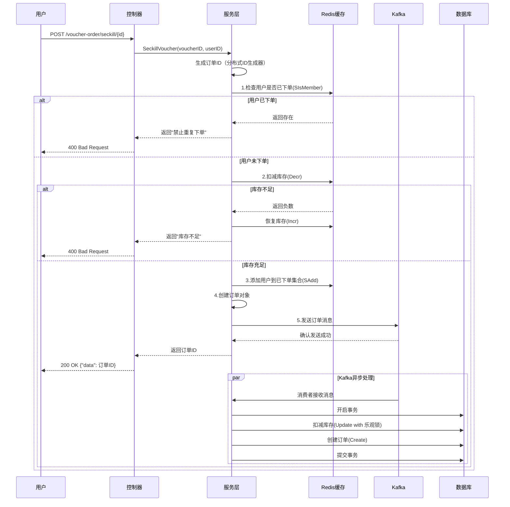

# 秒杀系统超卖问题分析与解决方案

## 一、核心业务场景

### 业务描述
秒杀是一种限时抢购活动，用户在特定时间内抢购限量商品或优惠券。在本项目中，主要是秒杀优惠券的场景，用户通过接口抢购限时优惠券，系统需要保证：

1. **库存限制**：每个秒杀优惠券有固定库存，售完即止
2. **一人一单**：每个用户只能购买一次该优惠券
3. **高并发处理**：秒杀活动通常会吸引大量用户同时参与，系统需要应对高并发请求
4. **数据一致性**：确保库存数据和订单数据的一致性，避免超卖或漏卖

### 业务流程概述
1. 用户发起秒杀请求，携带优惠券ID
2. 系统验证用户身份和优惠券有效性
3. 系统检查库存是否充足
4. 系统检查用户是否已购买过该优惠券
5. 系统扣减库存并创建订单
6. 系统返回订单ID给用户

## 二、技术细节与时序图

### 系统架构
- **前端**：用户通过浏览器或App发起秒杀请求，包含商品详情页、秒杀按钮、订单确认等界面
- **后端**：
  - **API网关**：负责请求路由、限流、认证授权，拦截恶意请求
  - **控制器层**：接收和处理HTTP请求，参数校验，返回响应
  - **服务层**：实现核心业务逻辑，包括秒杀判断、库存扣减、订单创建
  - **数据访问层**：与数据库交互，执行CRUD操作
  - **缓存层**：Redis用于库存管理、防重复下单、分布式锁
  - **消息队列**：Kafka用于异步处理订单，削峰填谷
  - **监控系统**：实时监控系统状态、性能指标、异常告警

### 核心技术栈
- **语言**：Go 1.25+，编译型语言，性能优异，并发处理能力强
- **Web框架**：Gin 1.12+，轻量级高性能框架，路由性能出色
- **数据库**：MySQL 5.7+，支持事务和索引优化
- **缓存**：Redis 7.0+，支持原子操作和多种数据结构
- **消息队列**：Kafka 3.0+，高吞吐量，持久化存储
- **ORM**：GORM 1.25+，简化数据库操作，支持事务
- **分布式ID**：基于Redis的分布式ID生成器（雪花算法）
- **服务注册与发现**：Etcd

### 技术选型理由
- **Go语言**：编译型语言，性能优异，goroutine并发模型适合高并发场景
- **Redis**：内存数据库，支持原子操作，适合处理秒杀等高频读写场景
- **Kafka**：高吞吐量，持久化存储，适合处理异步消息
- **MySQL**：成熟稳定，支持事务，适合持久化存储
- **Gin**：轻量级框架，路由性能出色，适合构建RESTful API
- **GORM**：简化数据库操作，支持事务，提高开发效率
- **Etcd**：服务注册与发现，支持分布式协调

### 时序图



### 关键代码实现

#### 1. 分布式ID生成器

黑马点评项目采用的ID生成策略，将一个64位的 Long 类型ID划分为三个部分：

- **符号位 (1 bit)**：固定为0，确保生成的ID是正数。
- **时间戳 (31 bits)**：记录生成ID时的秒级时间戳。可以使用69年。
- **序列号 (32 bits)**：在同一个秒内，通过 Redis 的自增操作生成的计数器。

项目使用的内容：

**// ID结构：41位时间戳 + 10位机器ID + 12位序列号 = 63位**

1. 获取当前的时间戳，ms级别

2. 如果时间戳相同，递增序列号

3. 如果序列号大于最大值，等待狭义ms

4. 如果时间戳不一致，重置序列号为0

5. 时间戳<<（服务器位数+序列位数）|（服务器ID<<序列位数）|序列号

6. 优点：

   - 全局唯一性，通过服务器ID区分不同的实例
   - 趋势递增，基于时间戳，ID大致递增
   - 无序访问redis
   - 高并发，1ms内容可以生成4096个ID(2^12=4096)

   #### 架构设计的不同

   ##### 黑马点评（依赖 Redis）：

   - 它的逻辑是：“不管我是哪台机器，我只要问 Redis 要一个号就行。”
   - **优点**：部署简单，不需要配置复杂的机器 ID，不用担心时钟回拨导致的冲突（因为 Redis 是单线程处理命令的，且 Key 按天分开）。
   - **缺点**：强依赖 Redis，每次生成 ID 都要进行一次网络 IO，性能受限于 Redis 的网络延迟。

   ##### **你提供的代码（依赖 Snowflake）：**

   - 它的逻辑是：“我是第 `workerID` 号机器，我在本地内存里记个数，不用问别人。”
   - **优点**：**性能极高**，纯内存操作，没有网络 IO 开销。
   - 缺点
     - **运维复杂**：必须保证集群中每台机器的 `workerID` 不一样（通常需要 Zookeeper 或配置文件来分配）。
     - **时钟回拨问题**：代码中专门写了 `if now < w.lastTime` 的判断。如果服务器时间回调，Snowflake 算法会直接报错或阻塞，这在生产环境中是一个著名的痛点。

   #### **ID 内部结构的差异**

   - **黑马点评**：
     - 它把 32 位全给了序列号。因为它是按天统计的，一天内生成 232232 （约 42 亿）个 ID 绰绰有余。
     - 时间戳只用了 31 位，且是秒级。
   - **你提供的代码**：
     - 它是标准的雪花算法结构。
     - **41位时间戳**：精确到毫秒，能用 69 年。
     - **10位机器ID**：支持 210=1024210=1024 台机器。
     - **12位序列号**：同一毫秒内，一台机器能生成 212=4096212=4096 个 ID。

7. | **维度**       | **黑马点评项目 (Redis 版)**            | **你提供的代码 (Snowflake 版)**            |
   | -------------- | -------------------------------------- | ------------------------------------------ |
   | **核心依赖**   | Redis (分布式缓存)                     | 本地内存 (单机状态)                        |
   | **ID 结构**    | 1位符号 + 31位时间戳(秒) + 32位序列号  | 41位时间戳(毫秒) + 10位机器ID + 12位序列号 |
   | **序列号来源** | Redis 的 `incr` 命令 (分布式锁/原子性) | **本地变量 `w.sequence` 自增 (内存操作)**  |
   | **序列号重置** | 每天重置 (Key 带日期)                  | **每毫秒重置 (代码逻辑)**                  |
   | 分布式实现     | 靠 Redis 单点保证唯一性                | 靠分配不同的 `workerID` (机器ID) 保证唯一  |
   | **时间精度**   | 秒级                                   | 毫秒级                                     |

```go
// RedisIDWorker 基于Redis的分布式ID生成器
type RedisIDWorker struct {
	rdb       *redis.Client
	workerID  int64 // 机器ID
	sequence  int64 // 序列号
	lastTime  int64 // 上次时间戳
}

// NextId 生成下一个ID
// ID结构：41位时间戳 + 10位机器ID + 12位序列号 = 63位
func (w *RedisIDWorker) NextId(ctx context.Context, key string) (int64, error) {
	// 获取当前时间戳（毫秒）
	now := time.Now().UnixMilli()

	// 如果当前时间小于上次时间，说明时钟回拨，返回错误
	if now < w.lastTime {
		return 0, fmt.Errorf("时钟回拨")
	}

	// 如果当前时间等于上次时间，序列号递增
	if now == w.lastTime {
		w.sequence = (w.sequence + 1) & 0xfff // 12位最大值4095
		// 如果序列号溢出，等待下一毫秒
		if w.sequence == 0 {
			now = w.waitNextMillis(w.lastTime)
		}
	} else {
		// 不同时间毫秒，序列号重置
		w.sequence = 0
	}

	w.lastTime = now

	// 组装ID：时间戳 << 22 | 机器ID << 12 | 序列号
	return (now-1704067200000)<<22 | w.workerID<<12 | w.sequence, nil
}
```

##### **Q1：为什么不用数据库自增 ID？为什么要用 Redis 或雪花算法？**

- **自增 ID**：有单点性能瓶颈（写数据库慢）、分库分表困难（ID 冲突）、暴露业务量（不安全）。
- **UUID**：太长（存储占用大）、无序（导致数据库索引性能下降，页分裂）。
- **Redis/雪花**：高性能、趋势递增（利于索引）、全局唯一。

##### **Q2：黑马点评中，Redis Key 为什么要带上日期（如 `icr:order:2026:04:07`）？**

- **方便统计**：可以直观地通过 Key 查看当天的订单生成数量。
- **防止溢出**：虽然 Long 类型很难溢出，但按天重置计数器，理论上序列号可以无限使用，不用担心长期运行导致的计数值过大问题。

##### **Q3：Redis 生成 ID 是线程安全的吗？`increment` 是原子操作吗？**

yes。单线程。

##### **Q4：如果是雪花算法（你提供的代码），`sequence` 自增是线程安全的吗？**

- **这是一个坑！** 在你提供的 Go 代码或 Java 实现中，如果多个线程同时调用 `NextId`，直接操作 `w.sequence` 变量是不安全的。
- **解决方案**：需要使用锁（`synchronized` 或 `ReentrantLock`），或者使用原子类（`AtomicLong`）来保证 `sequence` 的自增和判断逻辑是原子的。

1. **方案一：使用互斥锁（Mutex）。** 这是最直接的方法，能保证同一时刻只有一个线程生成 ID。但在超高并发下，锁竞争会成为性能瓶颈。

2. 方案二：使用原子操作（Atomic）。

    比如使用 CAS（Compare-And-Swap）机制。

   - 但在雪花算法中，我们需要同时更新 `sequence` 和判断 `lastTime`，这是一个**多变量复合操作**。单纯的 `AtomicLong` 只能保证单个变量的原子性，很难保证‘时间戳+序列号’这一整套逻辑的原子性。
   - 所以，在实际生产中，为了保证逻辑的严密性，我通常会选择**细粒度的锁**，或者将 ID 生成器设计为**单线程模型**（类似 Disruptor 模式），避免锁竞争。

##### **Q5：如果 Redis 挂了怎么办？（高可用）**

##### **Q6：什么是“时钟回拨”？你的代码里是怎么处理的？**

**考察点**：雪花算法的致命弱点。

回答思路

- **现象**：服务器时间因为 NTP 校准等原因，突然从“10点”跳回了“9点”。这会导致生成的 ID 比之前的小，甚至重复。
- **黑马点评方案**：不受影响，因为依赖 Redis 时间或当前系统时间作为 Key 的一部分，只要 Key 变了，ID 就变了。
- 雪花算法方案（你提供的代码）
  - **轻微回拨**（如几毫秒）：代码中通常会 `Thread.sleep()` 等待时间追上来。
  - **严重回拨**：直接拒绝生成 ID，抛出异常，并报警人工介入。

##### **Q7：雪花算法中的“机器 ID”（Worker ID）是怎么分配的？**

- **考察点**：分布式协调。
- 回答思路
  - **配置文件**：每台机器配一个不同的 `worker.id`（简单但维护麻烦）。
  - **IP/hostname 哈希**：根据 IP 计算，但容器重启 IP 变了会导致冲突（**这是个坑**）。
  - **Zookeeper/Etcd**：启动时去注册中心申请一个临时节点，自动分配 ID（最稳妥）。
  - **Redis**：类似黑马点评的思路，启动时去 Redis 抢一个 ID。

##### **Q8：同一毫秒内请求超过 4096 个怎么办？（序列号溢出）**

- **考察点**：高并发极限。

- 回答思路

  - “是的，这正是雪花算法在**单机超高并发**场景下的局限性。
    12 位序列号意味着单机单毫秒只能处理 4096 个请求（约 400万 QPS）。虽然这个数字很大，但一旦触发 `waitNextMillis`，线程就会**阻塞**，导致响应时间（RT）飙升。

  - **优化方案有两个维度：**

    1. **横向扩展（加机器）：** 这是最直接的。既然单机扛不住，就增加 Worker ID 的数量，分摊流量。

    2. 位宽调整（Trade-off）：

        如果我的业务确实单机流量巨大，但机器数量很少（比如只有 2 台），我可以

       牺牲机器位（Worker ID bits）来扩充序列号位（Sequence bits）

       。比如把 Worker ID 减到 5 位，序列号加到 17 位，这样单机单毫秒就能处理 13 万个请求。

       - **核心思想：** 这是一个根据业务特征（机器规模 vs 单机并发）进行**位宽权衡**的过程。”

#### 2. 控制器层

```go
// SeckillVoucher 秒杀优惠券下单
func (c *VoucherOrderController) SeckillVoucher(ctx *gin.Context) {
	// 参数校验
	idStr := ctx.Param("id")
	voucherID, err := strconv.ParseInt(idStr, 10, 64)
	if err != nil {
		ctx.JSON(http.StatusBadRequest, gin.H{"code": 400, "message": "参数错误"})
		return
	}

	// 从上下文获取用户ID（通过认证中间件获取）
	userID := utils.GetUserID(ctx)
	if userID == 0 {
		ctx.JSON(http.StatusUnauthorized, gin.H{"code": 401, "message": "未登录"})
		return
	}

	// 调用服务层处理秒杀逻辑
	orderID, err := c.voucherOrderService.SeckillVoucher(ctx, voucherID, userID)
	if err != nil {
		ctx.JSON(http.StatusBadRequest, gin.H{"code": 400, "message": err.Error()})
		return
	}

	ctx.JSON(http.StatusOK, gin.H{"code": 200, "message": "OK", "data": orderID})
}
```

#### 3. 服务层核心逻辑
```go
// SeckillVoucher 秒杀优惠券
func (s *VoucherOrderService) SeckillVoucher(ctx context.Context, voucherID, userID int64) (int64, error) {
	// 1. 生成订单ID - 使用基于Redis的分布式ID生成器
	orderId, err := s.idWorker.NextId(ctx, "order")
	if err != nil {
		return 0, err
	}

	// 2. 构建Redis键
	stockKey := utils.SeckillVoucherStockKey + strconv.FormatInt(voucherID, 10)
	orderKey := utils.SeckillVoucherOrderKey + strconv.FormatInt(voucherID, 10)

	// 3. 一人一单检查 - 使用Redis Set集合（SIsMember）
	exists, err := s.rdb.SIsMember(ctx, orderKey, userID).Result()
	if err != nil {
		return 0, err
	}
	if exists {
		return 0, fmt.Errorf("禁止重复下单")
	}

	// 4. 库存扣减 - 使用Redis原子操作（Decr）
	stock, err := s.rdb.Decr(ctx, stockKey).Result()
	if err != nil {
		return 0, err
	}
	if stock < 0 {
		// 库存不足，恢复库存
		s.rdb.Incr(ctx, stockKey)
		return 0, fmt.Errorf("库存不足")
	}

	// 5. 添加到已下单集合（SAdd），实现一人一单
	s.rdb.SAdd(ctx, orderKey, userID)

	// 6. 创建订单对象
	order := &model.VoucherOrder{
		ID:        orderId,
		UserID:    userID,
		VoucherID: voucherID,
		Status:    1, // 1-待支付
	}

	// 7. 发送消息到Kafka - 异步处理订单（削峰填谷）
	orderData, err := json.Marshal(order)
	if err != nil {
		// 序列化失败，恢复库存和订单状态
		s.rdb.Incr(ctx, stockKey)
		s.rdb.SRem(ctx, orderKey, userID)
		return 0, err
	}

	// 发送消息到Kafka
	err = s.kafkaWriter.WriteMessages(ctx, kafka.Message{
		Value: orderData,
	})
	if err != nil {
		// 发送失败，恢复库存和订单状态
		s.rdb.Incr(ctx, stockKey)
		s.rdb.SRem(ctx, orderKey, userID)
		return 0, err
	}

	// 8. 返回订单ID
	return orderId, nil
}
```

#### 4. Kafka消费者处理（异步扣减数据库库存）
```go
// startKafkaConsumer 启动Kafka消费者
func startKafkaConsumer(brokers []string, topic string, db *gorm.DB) {
	// 配置Kafka消费者
	reader := kafka.NewReader(kafka.ReaderConfig{
		Brokers:  brokers,
		Topic:    topic,
		GroupID:  "order-consumer",
		MaxBytes: 10e6, // 10MB
		MaxWait:  100 * time.Millisecond,
	})
	defer reader.Close()

	// 初始化仓库
	voucherRepo := repository.NewVoucherRepository(db)
	voucherOrderRepo := repository.NewVoucherOrderRepository(db)

	// 持续消费消息
	for {
		msg, err := reader.ReadMessage(context.Background())
		if err != nil {
			fmt.Printf("Error reading message: %v\n", err)
			continue
		}

		// 解析订单数据
		var order model.VoucherOrder
		if err := json.Unmarshal(msg.Value, &order); err != nil {
			fmt.Printf("Error unmarshaling order: %v\n", err)
			continue
		}

		// 处理订单 - 使用数据库事务确保原子性
		tx := db.Begin()
		defer func() {
			if r := recover(); r != nil {
				tx.Rollback()
				fmt.Printf("Panic recovered: %v\n", r)
			}
		}()

		// 1. 扣减库存 - 使用乐观锁（WHERE stock > 0）
		err = voucherRepo.UpdateSeckillVoucherStock(order.VoucherID)
		if err != nil {
			tx.Rollback()
			fmt.Printf("Error updating stock: %v\n", err)
			continue
		}

		// 2. 创建订单
		err = voucherOrderRepo.Create(&order)
		if err != nil {
			tx.Rollback()
			fmt.Printf("Error creating order: %v\n", err)
			continue
		}

		// 3. 提交事务
		if err := tx.Commit().Error; err != nil {
			fmt.Printf("Error committing transaction: %v\n", err)
			continue
		}

		fmt.Printf("Order processed successfully: %d\n", order.ID)
	}
}
```

#### 5. 仓库层实现
```go
// UpdateSeckillVoucherStock 更新秒杀优惠券库存（乐观锁）
func (r *VoucherRepository) UpdateSeckillVoucherStock(voucherID int64) error {
	// 使用乐观锁，确保库存大于0时才更新
	// WHERE条件包含 stock > 0，保证不会出现负数库存
	result := r.db.Model(&model.SeckillVoucher{}).
		Where("voucher_id = ? AND stock > 0", voucherID).
		Update("stock", gorm.Expr("stock - ?", 1))

	// 检查更新是否成功
	if result.Error != nil {
		return result.Error
	}

	// 检查是否有记录被更新（受影响行数为0说明库存不足或不存在）
	if result.RowsAffected == 0 {
		return fmt.Errorf("库存不足")
	}

	return nil
}

// Create 创建订单（利用数据库唯一索引防止重复）
func (r *VoucherOrderRepository) Create(order *model.VoucherOrder) error {
	return r.db.Create(order).Error
}
```

## 三、Redis数据结构详解

### 概述
Redis作为秒杀系统的核心缓存层，承担着库存管理、用户下单记录、限流等关键功能。本章节详细讲解秒杀系统中使用的各类Redis数据结构。

### 1. String类型 - 库存管理

#### 数据结构特性
- **最基础的key-value类型**
- 支持原子操作：INCR、DECR、INCRBY、DECRBY
- 适合存储数值类型的库存数据

#### 键设计
```
键名格式：seckill:stock:{voucherID}
示例：seckill:stock:1001
值：库存数量（整数）
过期时间：秒杀活动结束后保留（如24小时）
```

#### 核心操作
```go
// 1. 库存初始化（活动开始前）
stockKey := "seckill:stock:1001"
rdb.Set(ctx, stockKey, 100, 24*time.Hour)

// 2. 库存扣减（原子操作）
stockKey := "seckill:stock:1001"
stock, err := rdb.Decr(ctx, stockKey).Result()
// Decr返回扣减后的值，如果原值为0，扣减后变为-1

// 3. 库存恢复（扣减失败时）
rdb.Incr(ctx, stockKey)

// 4. 获取当前库存
stock, err := rdb.Get(ctx, stockKey).Int64()
```

#### 为什么使用String类型？
1. **原子性**：INCR/DECR操作是原子的，保证并发安全
2. **性能**：内存操作，速度极快（10万+ QPS）
3. **简单**：无需复杂的数据结构，操作直观
4. **可恢复**：库存扣减失败可以轻松恢复（INCR）

#### 库存扣减流程图
```
用户请求 → 检查库存(GET) → 库存充足?
                                      ↓
                    否                是
                     ↓                ↓
              返回"库存不足"    Decr库存 → 结果<0?
                                      ↓
                            是                否
                             ↓                ↓
                      Incr恢复         SAdd用户ID
                      返回错误         发送Kafka
```

### 2. Set类型 - 一人一单

#### 数据结构特性
- **无序且唯一的集合**
- 成员唯一性：同一用户ID只能添加一次
- 支持集合操作：SAdd、SRem、SIsMember、SUnion等
- 适合存储已下单用户ID集合

#### 键设计
```
键名格式：seckill:order:{voucherID}
示例：seckill:order:1001
值：用户ID集合（Set）
过期时间：秒杀活动结束后保留（如7天）
```

#### 核心操作
```go
// 1. 检查用户是否已下单（SIsMember）
orderKey := "seckill:order:1001"
userID := int64(12345)
exists, err := rdb.SIsMember(ctx, orderKey, userID).Result()
// 返回true表示用户已下单，false表示未下单
if exists {
    return fmt.Errorf("禁止重复下单")
}

// 2. 添加用户到已下单集合（SAdd）
orderKey := "seckill:order:1001"
userID := int64(12345)
rdb.SAdd(ctx, orderKey, userID)

// 3. 移除用户（取消订单时）
orderKey := "seckill:order:1001"
userID := int64(12345)
rdb.SRem(ctx, orderKey, userID)

// 4. 获取已下单用户数（SCARD）
orderKey := "seckill:order:1001"
count, err := rdb.SCard(ctx, orderKey).Result()

// 5. 获取所有已下单用户（SMEMBERS）
orderKey := "seckill:order:1001"
users, err := rdb.SMembers(ctx, orderKey).Result()
```

#### 一人一单实现原理
1. **SIsMember检查**：O(1)时间复杂度判断用户是否在集合中
2. **SAdd添加**：如果用户不存在则添加，如果已存在则忽略（但当前代码会在之前先检查）
3. **集合唯一性**：天然保证同一用户不会被重复添加

#### 一人一单流程图
```
用户请求 → 构建orderKey → SIsMember检查
                              ↓
                    存在              不存在
                      ↓                  ↓
              返回错误            SAdd用户ID
              (禁止重复下单)         ↓
                              继续处理
```

#### 与数据库唯一索引的配合
Redis的Set集合提供快速的一人一单检查，但作为缓存可能存在数据丢失风险。因此需要配合数据库唯一索引：
```sql
-- 数据库唯一索引
CREATE UNIQUE INDEX idx_user_voucher ON voucher_order(user_id, voucher_id);
```
双重保障：Redis快速拦截 + 数据库最终保证

### 3. String类型 - 分布式锁

#### 键设计
```
键名格式：lock:seckill:{voucherID}
示例：lock:seckill:1001
值：锁持有者的唯一标识（如用户ID或UUID）
过期时间：一般设置为5-10秒
```

#### 核心操作
```go
// 1. 获取分布式锁（SETNX）
lockKey := "lock:seckill:1001"
lockValue := uuid.New().String()
expireTime := 10 * time.Second

// SET key value EX seconds NX
locked, err := rdb.SetNX(ctx, lockKey, lockValue, expireTime).Result()
if err != nil {
    return 0, err
}
if !locked {
    return 0, fmt.Errorf("系统繁忙，请稍后再试")
}

// 2. 释放分布式锁（Lua脚本，保证原子性）
luaScript := `
if redis.call("get", KEYS[1]) == ARGV[1] then
    return redis.call("del", KEYS[1])
else
    return 0
end
`
rdb.Eval(ctx, luaScript, []string{lockKey}, lockValue)
```

#### 分布式锁的作用
1. **防止缓存击穿**：同一时间只有一个请求去查询数据库
2. **保证原子性**：确保库存检查和扣减一起执行
3. **互斥性**：同一用户同一商品只能有一个请求获得锁

### 4. String类型 - 限流

#### 键设计
```
键名格式：limit:user:{userID}:{api}
示例：limit:user:12345:/api/voucher/seckill
值：计数器值
过期时间：时间窗口（如60秒）
```

#### 核心操作
```go
// 限流检查（滑动窗口）
limitKey := "limit:user:12345:/api/voucher/seckill"
windowTime := 60 * time.Second
maxRequests := 5

// INCR原子递增
count, err := rdb.Incr(ctx, limitKey).Result()
if err != nil {
    return 0, err
}

// 首次访问设置过期时间
if count == 1 {
    rdb.Expire(ctx, limitKey, windowTime)
}

// 检查是否超过限制
if count > int64(maxRequests) {
    return 0, fmt.Errorf("请求过于频繁，请稍后再试")
}
```

### 5. Hash类型 - 订单缓存

#### 键设计
```
键名格式：order:cache:{orderID}
示例：order:cache:1704067200000123456
值：订单信息（Hash）
```

#### 核心操作
```go
// 1. 存储订单信息
orderKey := "order:cache:1704067200000123456"
rdb.HSet(ctx, orderKey, map[string]interface{}{
    "id":         order.ID,
    "user_id":    order.UserID,
    "voucher_id": order.VoucherID,
    "status":     order.Status,
    "create_time": order.CreateTime,
})
rdb.Expire(ctx, orderKey, 30*time.Minute)

// 2. 获取订单信息
orderData, err := rdb.HGetAll(ctx, orderKey).Result()
```

### 6. 有序集合Sorted Set - 延迟队列

#### 键设计
```
键名格式：delay:order:expire
值：成员为订单ID，分数为超时时间戳
```

#### 核心操作
```go
// 1. 添加延迟任务（订单15分钟未支付）
delayKey := "delay:order:expire"
orderID := int64(12345)
expireTime := time.Now().Add(15 * time.Minute).Unix()

rdb.ZAdd(ctx, delayKey, &redis.Z{
    Score:  float64(expireTime),
    Member: orderID,
})

// 2. 扫描超时订单
now := time.Now().Unix()
timeoutOrders, err := rdb.ZRangeByScore(ctx, delayKey, &redis.ZRangeByScore{
    Min: "0",
    Max: fmt.Sprintf("%d", now),
}).Result()

// 3. 处理超时订单
for _, orderID := range timeoutOrders {
    // 取消订单逻辑
    rdb.ZRem(ctx, delayKey, orderID)
}
```

### Redis数据结构对比表

| 数据结构 | 用途 | 键示例 | 操作命令 | 时间复杂度 |
|---------|------|--------|----------|------------|
| String | 库存计数 | seckill:stock:1001 | DECR/INCR | O(1) |
| Set | 一人一单 | seckill:order:1001 | SIsMember/SAdd | O(1) |
| String | 分布式锁 | lock:seckill:1001 | SETNX | O(1) |
| String | 限流 | limit:user:12345 | INCR | O(1) |
| Hash | 订单缓存 | order:cache:12345 | HSet/HGet | O(1) |
| Sorted Set | 延迟队列 | delay:order:expire | ZAdd/ZRangeByScore | O(logN+M) |

## 四、业务流程与关键步骤

### 业务流程
1. **用户请求**：用户通过浏览器或App点击秒杀按钮，发起HTTP POST请求到 `/voucher-order/seckill/{id}` 接口
2. **认证处理**：认证中间件验证用户Token，提取用户ID
3. **参数校验**：控制器层验证优惠券ID和用户ID的有效性
4. **分布式ID生成**：使用Redis生成分布式唯一订单ID
5. **一人一单检查**：Redis的Set集合检查用户是否已购买
6. **库存扣减**：Redis的Decr原子操作扣减库存
7. **记录下单用户**：Redis的SAdd添加到已下单集合
8. **异步处理**：Kafka消息队列发送订单信息
9. **返回结果**：立即返回订单ID给用户（提高响应速度）
10. **后台处理**：Kafka消费者异步处理：数据库事务扣减库存+创建订单

### 关键步骤详解

#### 步骤1：分布式ID生成
- **实现方式**：基于Redis的分布式ID生成器（类似雪花算法）
- **ID结构**：41位时间戳 + 10位机器ID + 12位序列号 = 63位
- **代码实现**：
  ```go
  orderId, err := s.idWorker.NextId(ctx, "order")
  ```
- **技术细节**：
  - 时间戳使用毫秒级，保证ID有序
  - 机器ID区分不同服务器
  - 序列号支持同一毫秒内多请求
  - 时钟回拨保护

#### 步骤2：一人一单检查
- **实现方式**：Redis Set集合 + 数据库唯一索引双重保障
- **代码实现**：
  ```go
  orderKey := "seckill:order:" + strconv.FormatInt(voucherID, 10)
  exists, _ := s.rdb.SIsMember(ctx, orderKey, userID).Result()
  if exists {
      return 0, fmt.Errorf("禁止重复下单")
  }
  s.rdb.SAdd(ctx, orderKey, userID)
  ```
- **技术细节**：
  
  - Redis层：O(1)时间复杂度，响应快速
  - 数据库层：唯一索引兜底，防止数据丢失
  - 键名设计：seckill:order:{voucherID}

#### 步骤3：库存扣减
- **实现方式**：Redis原子操作Decr
- **代码实现**：
  ```go
  stockKey := "seckill:stock:" + strconv.FormatInt(voucherID, 10)
  stock, _ := s.rdb.Decr(ctx, stockKey).Result()
  if stock < 0 {
      s.rdb.Incr(ctx, stockKey) // 恢复库存
      return 0, fmt.Errorf("库存不足")
  }
  ```
- **技术细节**：
  - Decr是原子操作，无并发问题
  - 库存不足时立即恢复库存
  - 键名设计：seckill:stock:{voucherID}

#### 步骤4：异步处理
- **实现方式**：Kafka消息队列
- **代码实现**：
  ```go
  orderData, _ := json.Marshal(order)
  s.kafkaWriter.WriteMessages(ctx, kafka.Message{Value: orderData})
  ```
- **技术细节**：
  - 生产者-消费者模式
  - 削峰填谷：避免数据库瞬时压力过大
  - 可靠性：Kafka持久化保证消息不丢失

#### 步骤5：数据库事务
- **实现方式**：GORM事务
- **代码实现**：
  ```go
  tx := db.Begin()
  voucherRepo.UpdateSeckillVoucherStock(order.VoucherID)
  voucherOrderRepo.Create(&order)
  tx.Commit()
  ```
- **技术细节**：
  - 乐观锁：WHERE stock > 0
  - 影响行数检查：RowsAffected == 0 表示库存不足
  - 事务回滚：异常时自动回滚

## 五、超卖问题解决方案

### 超卖产生的原因
1. **并发请求**：多个用户同时请求购买，导致库存检查和扣减不是原子操作，产生竞态条件
2. **缓存与数据库不一致**：Redis库存和数据库库存不同步，可能导致库存数据错误
3. **网络延迟**：请求处理过程中的网络延迟导致库存状态判断错误
4. **事务隔离级别**：数据库事务隔离级别设置不当，可能导致脏读、幻读等问题
5. **分布式环境**：分布式系统中，不同节点之间的库存数据同步延迟

### 解决方案

#### 1. Redis原子操作
- **实现原理**：使用Redis的`Decr`命令扣减库存，利用Redis的单线程特性确保操作原子性
- **技术细节**：
  
  - Redis的`Decr`命令是原子操作，不会受到并发请求的影响
  - 扣减后检查库存是否为负数，若为负数则恢复库存
  - 键名格式：`seckill:stock:{voucherID}`
- **代码实现**：
  
  ```go
  stock, err := s.rdb.Decr(ctx, stockKey).Result()
  if stock < 0 {
      s.rdb.Incr(ctx, stockKey)
      return 0, fmt.Errorf("库存不足")
  }
  ```
- **优势**：性能极高，适合高并发场景
- **劣势**：依赖Redis，需要保证Redis高可用

#### 2. 数据库乐观锁
- **实现原理**：在更新库存时添加`stock > 0`的条件，确保只有库存大于0时才更新
- **技术细节**：
  - 使用`WHERE stock > 0`条件
  - 检查更新结果的影响行数
  - 结合数据库事务确保原子性
- **代码实现**：
  ```go
  result := r.db.Model(&model.SeckillVoucher{}).
      Where("voucher_id = ? AND stock > 0", voucherID).
      Update("stock", gorm.Expr("stock - ?", 1))
  if result.RowsAffected == 0 {
      return fmt.Errorf("库存不足")
  }
  ```
- **优势**：数据库层面的保障，不依赖Redis
- **劣势**：性能相对较低

#### 3. 双重校验机制
- **实现原理**：Redis层面和数据库层面都进行库存检查，双重保障
- **实现流程**：
  1. Redis扣减库存（高性能）
  2. Kafka发送消息
  3. Kafka消费者使用数据库乐观锁二次扣减
- **优势**：结合Redis高性能和数据库可靠性

#### 4. 分布式锁
- **实现原理**：使用Redis的`SETNX`命令实现分布式锁
- **代码实现**：
  ```go
  lockKey := "lock:seckill:" + strconv.FormatInt(voucherID, 10)
  locked, _ := rdb.SetNX(ctx, lockKey, "1", 10*time.Second).Result()
  if !locked {
      return 0, fmt.Errorf("系统繁忙")
  }
  defer rdb.Del(ctx, lockKey)
  // 执行业务逻辑
  ```
- **优势**：确保库存操作的互斥性
- **劣势**：可能影响性能，需要合理设置锁粒度

#### 5. 库存预热
- **实现原理**：秒杀活动开始前，将库存数据加载到Redis
- **代码实现**：
  ```go
  func initStock(voucherID int64, stock int) {
      stockKey := "seckill:stock:" + strconv.FormatInt(voucherID, 10)
      rdb.Set(ctx, stockKey, stock, 24*time.Hour)
  }
  ```
- **优势**：减少秒杀开始时的数据库压力

## 六、一人一单实现详解

### 一人一单是否已实现？
**已实现。** 本项目采用了Redis Set + 数据库唯一索引的双重保障机制。

### 实现方案

#### 1. Redis层实现（SIsMember + SAdd）
```go
// 检查是否已经下单
orderKey := utils.SeckillVoucherOrderKey + strconv.FormatInt(voucherID, 10)
exists, err := s.rdb.SIsMember(ctx, orderKey, userID).Result()
if err != nil {
    return 0, err
}
if exists {
    return 0, fmt.Errorf("禁止重复下单")
}

// 添加到已下单集合
s.rdb.SAdd(ctx, orderKey, userID)
```

#### 2. 数据库层实现（唯一索引）
```sql
-- 订单表创建唯一索引
CREATE UNIQUE INDEX idx_user_voucher ON voucher_order(user_id, voucher_id);
```

#### 3. 双重保障流程
```
用户请求 → Redis SIsMember检查
              ↓
      已存在 → 返回错误（快速返回）
      不存在 → SAdd添加用户
              ↓
         发送Kafka
              ↓
    数据库创建订单 → 唯一索引冲突?
              ↓
         是 → 回滚，返回错误
         否 → 成功创建订单
```

### 技术细节
1. **键名设计**：`seckill:order:{voucherID}`
2. **过期时间**：建议设置为秒杀活动结束后的1-7天
3. **集合特性**：Set成员唯一，天然防止重复
4. **时间复杂度**：SIsMember和SAdd都是O(1)

### 潜在问题与优化
1. **Redis数据丢失**：使用AOF + 副本集保证Redis可靠性
2. **数据库兜底**：唯一索引作为最后防线
3. **并发问题**：高并发下SIsMember和SAdd不是原子操作，需要配合分布式锁

## 面试回答

其实一开始我尝试过用string来实现一人一单的逻辑的，将用户ID和商品ID组合起来，组成key，Value则是一个简单的占位符。

- **检查**：当用户发起秒杀请求时，我们尝试用这个唯一的 Key 去 Redis 执行一个“如果不存在则设置”的操作，即 `SETNX` (SET if Not eXists)。
- **成功**：如果 `SETNX` 返回成功（值为1），说明这个 Key 之前不存在，即该用户没有买过这个商品。此时，我们成功“占位”，可以继续后续的下单流程。
- **失败**：如果 `SETNX` 返回失败（值为0），说明这个 Key 已经存在了，即该用户已经下过单。我们直接拦截，返回“禁止重复下单”。

`SETNX` 是一个原子操作，**天然解决了并发问题，性能极高。**这种方案的缺点是**无法快速统计商品的总销量**。我想知道商品A被多少人买了，就需要用 `KEYS seckill:order:*:voucherId:A` 这样的命令去扫描，这在生产环境是**严重禁忌**，会阻塞 Redis。


所以我选择用set的数据结构来实现一人一旦，key是seckill:order:voucherId:{voucherId}商品的ID，为每个商品创建一个Set集合，然后将购买用户的 ID `userId` 作为元素添加到这个集合中。

**先通过 `SISMEMBER` 检查用户ID是否在集合中，下单成功后再通过 `SADD` 将用户ID加入。为了保证原子性，我会将这两个操作封装在 Lua 脚本 中执行。**

这种情况下如果后期想统计商品的购买人数，用SCARD命令，O（1）时间复杂度就可以获得该买商品的数量，且一个商品对应一个购买用户列表，符合业务的需求。就是在实现上可能复杂一些，需要编写lua脚本实现。


**总结来说**，虽然 String 的 `SETNX` 方案在判断唯一性上非常高效，但 Set 方案在**业务扩展性**和**运维监控**上更有优势。考虑到秒杀活动需要实时关注商品销量，我最终选择了 Set 方案。”

```
-- KEYS[1]: orderKey (seckill:order:101)
-- ARGV[1]: userId
-- 1. 检查是否存在
if redis.call('SISMEMBER', KEYS[1], ARGV[1]) == 1 then
    return -1 -- 已存在，返回错误码
end

-- 2. 扣减库存 (假设库存 key 在 KEYS[2])
local stock = redis.call('DECR', KEYS[2])
if stock < 0 then
    redis.call('INCR', KEYS[2]) -- 恢复库存
    return -2 -- 库存不足
end

-- 3. 标记用户已买
redis.call('SADD', KEYS[1], ARGV[1])
return 0 -- 成功
```


## 七、订单超时未支付自动取消

### 当前实现状态
**未实现**。当前代码中只有订单创建逻辑，缺少订单超时取消功能。

### 解决方案

#### 方案1：定时任务扫描（推荐）
```go
// CronJob 扫描超时未支付订单
func (s *VoucherOrderService) CancelTimeoutOrders(ctx context.Context) {
    // 查询超时订单（创建时间超过15分钟且状态为待支付）
    timeout := time.Now().Add(-15 * time.Minute)
    orders, err := s.voucherOrderRepo.FindTimeoutOrders(timeout)
    if err != nil {
        return
    }

    for _, order := range orders {
        // 开启事务
        tx := s.db.Begin()

        // 1. 更新订单状态为已取消
        err = s.voucherOrderRepo.UpdateStatus(order.ID, 4) // 4-已取消
        if err != nil {
            tx.Rollback()
            continue
        }

        // 2. 恢复库存（Redis + 数据库）
        stockKey := "seckill:stock:" + strconv.FormatInt(order.VoucherID, 10)
        s.rdb.Incr(ctx, stockKey)

        // 3. 从Redis已下单集合中移除用户
        orderKey := "seckill:order:" + strconv.FormatInt(order.VoucherID, 10)
        s.rdb.SRem(ctx, orderKey, order.UserID)

        // 4. 数据库恢复库存
        err = s.voucherRepo.IncrStock(order.VoucherID)
        if err != nil {
            tx.Rollback()
            continue
        }

        tx.Commit()

        // 5. 通知用户（可选）
        fmt.Printf("Order %d cancelled due to timeout\n", order.ID)
    }
}
```

#### 方案2：Redis过期键监听
```go
// 1. 下单时设置订单过期键
orderExpireKey := "order:expire:" + strconv.FormatInt(orderID, 10)
s.rdb.Set(ctx, orderExpireKey, "1", 15*time.Minute)

// 2. 开启Redis键空间通知
// config set notify-keyspace-events Ex

// 3. 监听过期事件
pubsub := s.rdb.Subscribe(ctx, "__keyevent@0__:expired")
ch := pubsub.Channel()
for msg := range ch {
    orderID, _ := strconv.ParseInt(strings.TrimPrefix(msg.Payload, "order:expire:"), 10)
    // 处理取消订单逻辑
}
```

#### 方案3：延迟队列
```go
// 1. 下单时添加延迟任务
delayKey := "delay:order:cancel"
expireTime := time.Now().Add(15 * time.Minute).Unix()
s.rdb.ZAdd(ctx, delayKey, &redis.Z{
    Score:  float64(expireTime),
    Member: orderID,
})

// 2. 后台goroutine扫描
go func() {
    for {
        now := time.Now().Unix()
        timeoutOrders, _ := s.rdb.ZRangeByScore(ctx, delayKey, &redis.ZRangeByScore{
            Min: "0",
            Max: fmt.Sprintf("%d", now),
        }).Result()

        for _, orderID := range timeoutOrders {
            // 处理取消订单逻辑
            s.rdb.ZRem(ctx, delayKey, orderID)
        }
        time.Sleep(10 * time.Second)
    }
}()
```

### 取消订单处理流程
```
触发取消 → 开始事务
          ↓
    更新订单状态（已取消）
          ↓
    Redis库存+1（Incr）
          ↓
    Redis移除用户（SRem）
          ↓
    数据库库存+1
          ↓
    提交事务
          ↓
    通知用户（可选）
```

## 八、为什么用Redis做秒杀？

### 性能对比
| 特性 | Redis | MySQL |
|------|-------|-------|
| 存储介质 | 内存 | 磁盘 |
| 读写速度 | 10万+ QPS | 1千-1万 QPS |
| 并发能力 | 单线程，无锁竞争 | 多线程，有锁竞争 |
| 原子操作 | 丰富（Decr、SAdd等） | 有限 |
| 延迟 | 亚毫秒级 | 毫秒级 |

### 选择Redis的原因

#### 1. 高性能
- 内存操作，避免磁盘IO
- 单线程模型，无锁竞争
- 10万+ QPS轻松应对秒杀流量

#### 2. 原子操作
- Decr：库存原子扣减
- SIsMember：一人大单检查
- SetNX：分布式锁

#### 3. 丰富数据结构
- String：库存计数
- Set：一人一单
- 有序集合：延迟队列

#### 4. 削峰填谷
- 前置拦截无效请求
- 减轻数据库压力
- 异步处理提高吞吐量

## 九、秒杀系统架构设计

### 整体架构
```
┌─────────────────────────────────────────────────────────────────┐
│                           用户请求                               │
└─────────────────────────────────────────────────────────────────┘
                                ↓
┌─────────────────────────────────────────────────────────────────┐
│                      API网关（Nginx）                            │
│                  限流、路由、认证、熔断                           │
└─────────────────────────────────────────────────────────────────┘
                                ↓
┌─────────────────────────────────────────────────────────────────┐
│                      订单服务（多实例）                          │
│  ┌──────────────┐  ┌──────────────┐  ┌──────────────┐          │
│  │   实例1      │  │   实例2      │  │   实例3      │          │
│  └──────────────┘  └──────────────┘  └──────────────┘          │
└─────────────────────────────────────────────────────────────────┘
           ↓                    ↓                    ↓
┌─────────────────────────────────────────────────────────────────┐
│                        Redis集群                                 │
│  ┌──────────────────────────────────────────────────────────┐  │
│  │ seckill:stock:1001 | seckill:order:1001 | 限流计数器     │  │
│  └──────────────────────────────────────────────────────────┘  │
└─────────────────────────────────────────────────────────────────┘
           ↓
┌─────────────────────────────────────────────────────────────────┐
│                      Kafka集群                                   │
│              topic: order-create（消息持久化）                   │
└─────────────────────────────────────────────────────────────────┘
           ↓
┌─────────────────────────────────────────────────────────────────┐
│                    Kafka消费者                                   │
│              异步处理：扣库存+建单+事务                          │
└─────────────────────────────────────────────────────────────────┘
           ↓
┌─────────────────────────────────────────────────────────────────┐
│                    MySQL集群                                     │
│  ┌──────────────┐  ┌──────────────┐                            │
│  │   主库       │  │   从库       │                            │
│  └──────────────┘  └──────────────┘                            │
│  voucher_order表（唯一索引：user_id+voucher_id）                │
└─────────────────────────────────────────────────────────────────┘
```

### 组件说明

#### 1. API网关层
- **功能**：限流、路由、认证、熔断
- **技术**：Nginx/OpenResty + Lua

#### 2. 服务层
- **功能**：业务逻辑处理
- **技术**：Go + Gin + 多实例部署
- **特点**：无状态，可水平扩展

#### 3. 缓存层
- **功能**：库存管理、一人一单、限流
- **技术**：Redis Cluster
- **高可用**：主从复制 + 自动故障转移

#### 4. 消息队列
- **功能**：异步处理、削峰填谷
- **技术**：Kafka集群
- **可靠性**：消息持久化 + 消费者组

#### 5. 数据层
- **功能**：持久化存储
- **技术**：MySQL主从
- **约束**：唯一索引保证一人一单

## 十、面试高频问答

### 1. 如何解决秒杀系统的超卖问题？
**答案**：
- Redis原子操作（Decr）
- 数据库乐观锁（WHERE stock > 0）
- 双重校验机制
- 事务保证

### 2. 为什么使用Redis做秒杀？
**答案**：
- 性能优势（10万+ QPS）
- 原子操作（Decr、SIsMember）
- 丰富数据结构
- 削峰填谷

### 3. 如何实现一人一单？
**答案**：
- Redis Set（SIsMember + SAdd）
- 数据库唯一索引（user_id + voucher_id）
- 双重保障

### 4. 消息队列如何保证不丢失？
**答案**：
- 生产者：同步发送 + 重试机制
- Kafka：持久化 + 副本机制
- 消费者：手动提交偏移量

### 5. 如何处理订单超时未支付？
**答案**：
- 定时任务扫描
- Redis过期键监听
- 延迟队列

### 6. 分布式锁如何实现？
**答案**：
- Redis SETNX
- Lua脚本释放锁
- 看门狗机制

### 7. 如何设计分布式ID生成器？
**答案**：
- 雪花算法
- Redis INCR
- 数据库自增

### 8. 库存如何同步到Redis？
**答案**：
- 活动开始前预热
- 定时同步
- 定期对账

### 9. 如何应对突发流量？
**答案**：
- 限流
- 降级
- 熔断
- 水平扩展

### 10. 秒杀系统性能如何优化？
**答案**：
- Redis缓存
- 异步处理
- 减少数据库操作
- 批量处理

### 11. 如何保证Redis和MySQL一致性？
**答案**：
- 最终一致性
- 定期对账
- 双写策略

### 12. 如何防止恶意刷单？
**答案**：
- 限流
- 验证码
- IP限制
- 行为分析

---

## 十一、大厂面试高频问题（新增50道）

### 基础概念类

1. 什么是秒杀？秒杀系统有什么特点？
2. 秒杀场景下为什么要使用Redis而不是直接操作MySQL？
   - 传统的磁盘数据库（如 MySQL），受限于磁盘 I/O 和复杂的执行计划，单机 QPS 通常在 **几千到一万** 左右，响应延迟在 **毫秒级**。而 Redis 基于**纯内存操作**，避免了昂贵的磁盘 I/O。它的响应延迟可以达到 **微秒级**（甚至亚微秒级），单机 QPS 轻松突破 **10 万+**，在优化良好的场景下甚至能达到 **百万级**。在秒杀这种瞬时流量可能达到几十万 QPS 的场景下，只有 Redis 能扛得住这种流量洪峰，而不会像数据库那样瞬间被打挂。
   - 不同于多线程数据库需要处理复杂的线程上下文切换和锁竞争（Lock Contention），Redis 单线程处理命令，天然避免了锁的开销。Redis 底层使用了 epoll（Linux 下）等 I/O 多路复用技术，这使得单线程也能高效地同时处理成千上万个网络连接。
   - **原子性保障**：Redis 的很多命令（如 `DECR`、`INCR`）都是原子性的。**Lua 脚本**：对于更复杂的‘检查库存+扣减’逻辑，我会使用 **Lua 脚本**。Redis 在执行 Lua 脚本时会保证整个脚本的原子性，中间不会被其他客户端的命令插入。这使得我可以在 Redis 层直接完成库存扣减，既保证了**数据强一致性**（绝不超卖），又避免了引入分布式锁带来的性能损耗。”
3. 解释一下什么是缓存穿透、缓存击穿、缓存雪崩？
4. 什么是分布式锁？分布式锁的实现方式有哪些？
5. 什么是乐观锁和悲观锁？分别适用于什么场景？
6. 什么是幂等性？如何保证接口的幂等性？
7. 解释一下CAP定理和BASE理论？
   - 在分布式系统的所有数据副本中，每次读操作，要么返回最新的写操作结果，要么返回一个错误。
   - 系统提供的服务必须一直处于可用状态。对于每一个非故障节点的请求，必须在合理的时间内得到一个非错误的响应（不保证是最新数据）。
   - 当分布式系统节点之间因为网络故障（“分区”）导致通信中断时，系统仍然能够继续对外提供服务。
8. 什么是最终一致性？如何实现最终一致性？

### Redis相关

9. Redis为什么这么快？它的单线程模型是怎样的？
10. Redis有哪些数据结构？分别适用于什么场景？
11. 解释一下Redis的持久化机制（RDB和AOF）？
12. Redis主从复制原理是什么？如何保证高可用？
13. Redis Cluster的原理是什么？如何实现数据分片？
14. Redis的过期键删除策略有哪些？
15. Redis的内存淘汰策略有哪些？
16. 如何解决Redis缓存与数据库的数据一致性问题？
17. Redis的Pipeline是什么？有什么作用？
18. Redis的Lua脚本有什么优势？如何使用？
19. 什么是Redis的事务？如何保证原子性？
20. Redis如何实现分布式锁？看门狗机制是什么？

### Kafka相关

21. Kafka为什么吞吐量这么高？
22. Kafka的分区机制是什么？如何保证消息顺序？
23. Kafka的消费者组是什么？如何实现负载均衡？
24. Kafka如何保证消息不丢失？
25. Kafka如何保证消息不重复消费（幂等性）？
26. 什么是Kafka的位移(offset)？如何管理？
27. Kafka的ISR机制是什么？
28. 如何处理Kafka的消息积压问题？

### 秒杀场景专题

29. 秒杀系统如何防止超卖？
30. 秒杀系统如何实现限流？有哪些限流算法？
31. 秒杀系统如何保证一人一单？
32. 库存扣减的原子操作如何实现？
33. 如何设计秒杀系统的降级和熔断策略？
34. 秒杀活动开始前需要做哪些准备工作（预热）？
35. 如何处理秒杀结束后的库存对账问题？
36. 秒杀系统如何防止恶意刷单？
37. 分布式ID生成器在秒杀系统中的作用是什么？
38. 如何设计秒杀系统的超时未支付订单处理？

### 数据库相关

39. MySQL的行锁和表锁有什么区别？
40. 什么是MySQL的事务隔离级别？各有什麼问题？
41. MySQL的索引原理是什么？B+树和B树有什么区别？
42. 什么情况下索引会失效？
43. 如何优化慢查询SQL？
44. MySQL主从复制的原理是什么？如何解决延迟？
45. 分库分表的实现方案有哪些？分片键如何选择？
46. 什么是读写分离？如何实现？

### 架构设计

47. 高并发系统应该如何设计？需要考虑哪些因素？
48. 什么是削峰填谷？如何实现？
49. 微服务架构下如何实现服务治理？
50. 如何设计一个高可用的秒杀系统？
51. 什么是灰度发布？如何实现？
52. 如何设计接口的限流组件？
53. 分布式事务的实现方案有哪些？（2PC、3PC、TCC）
54. 什么是本地消息表？它是如何解决分布式事务的？
55. 如何保证优惠券发放的准确性？

### Go语言相关

56. Go语言的goroutine和channel了解吗？
57. Go语言的GC机制是什么？如何调优？
58. Go语言如何实现并发安全？
59. Go语言的context用于什么场景？
60. Go语言的defer、panic、recover机制了解吗？

### 线上问题排查

61. 如何排查高并发下的性能问题？
62. 如何定位Redis的热key？
63. 如何处理MySQL的死锁问题？
64. 如何监控系统性能指标？（QPS、RT、错误率）
65. 如何设计告警规则？
66. 如何进行全链路追踪？

### 项目经验

67. 你在秒杀项目中遇到的最大挑战是什么？如何解决的？
68. 秒杀系统的QPS能到多少？如何评估？
69. 如何评估系统容量？如何进行压测？
70. 秒杀系统上线后需要注意哪些监控指标？

---

## 十二、总结

秒杀系统是一个典型的高并发场景，需要综合考虑性能、可靠性和数据一致性。本项目通过以下技术手段解决了秒杀系统的核心问题：

1. **Redis原子操作（Decr）**：解决超卖问题
2. **Redis Set（SIsMember + SAdd）**：实现一人一单
3. **Kafka消息队列**：异步处理，削峰填谷
4. **数据库乐观锁**：保证数据最终一致性
5. **分布式ID生成器**：确保订单ID唯一性
6. **多层次校验**：Redis + 数据库双重保障

这种架构设计不仅能够应对高并发秒杀场景，还具有良好的可扩展性和可维护性。通过合理的技术选型和架构设计，系统能够在保证数据一致性的同时，提供良好的用户体验。